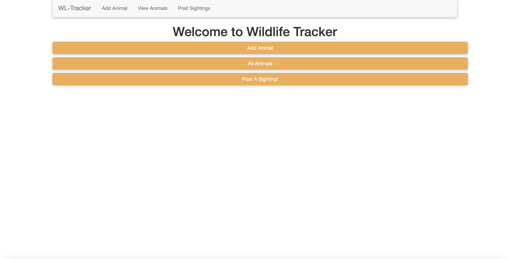
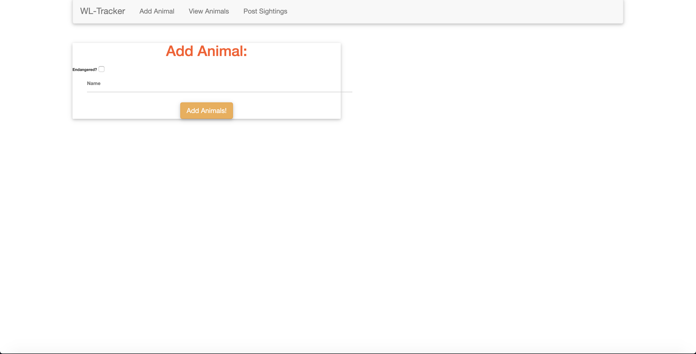
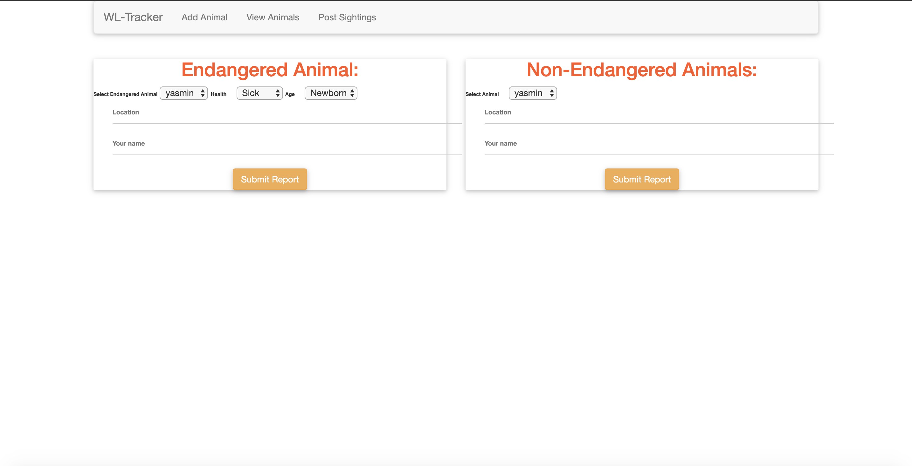

# WildlifeTracker
This program allows Rangers to track wildlife in a particular area and post the sightings

Version 1.0.0

# Contributors
Yasmin Abdirahman

## Description and Usage
This program uses spark forms,velocity template engine to allow rangers to add animals to there animal database, the rangers
choose to group the animals as endangered and non endangered animals. Among the endangered animals the prograp allows the rangers
to post sightings and details of the sighting such as the location of the sightng, who sighted the animal, the age and health of
animal sighted

### This is the homepage of the website, it lets you choose whether you want to add an animal, view the animals or post a sighting

### Here the website allows you to add an animal to the website and choose whether it is endangered or not

### Here the website allows you to post sighting details of the animal

## BDD
|Behaviour   	|  Input  	|   Output	|
|---	|---	|---	|
|Add animal  	|Add animal to your databse and choose whether it is endangered or not|Animal created and added to list|
|Add animal sighting details	|Add details such as health age and sighting locations|Animal sighting details added|

## Setup Installation Requirement
* Download repository on github: https://github.com/ya7skaa/WildlifeTracker
* Install Gradle https://gradle.org/
* Install PostgresSQL https://www.postgresql.org/
* In your computers Terminal application, type the command 'postgres'
* In another tab in the terminal type the command 'psql'
* In this same tab, type the command 'CREATE DATABASE wildlife_tracker;', and then '\c wildlife_tracker'
* In a third tab of terminal, navigate to your browsers download directory
* go into the hair-salon directory from github, and still in terminal, type the command 'psql hair_salon < wildlife_tracker.sql'
*  now still in the hair_salon directory in terminal, execute the gradle command 'gradle run'
* A server will begin running. You may now exit the terminal and open a web browser of your choice.
* In the web browser, enter the URL 'localhost:3456' this will open the WildlifeTracker page

## Technologies Used
1. Java
2. Spark Micro-framework
3. Velocity Template Engine
4. CSS
5. SQL

## Known Bugs
- A few of the bugs is the edit feature for the stylists isn't functional as well as the delete feature for the clients list.
Other than that no other bugs detected.

### Support or questions
- For any comments,suggestions,feedback or inquiries, contact me via email: `yaazzmineoz@gmail.com`
- Make contributions to the code.

## License
- This project is licensed under the MIT Open Source license (https://opensource.org/licenses/MIT) Copyright (c) 2019. [Yasmin Abdirahman](https://github.com/ya7skaa)
